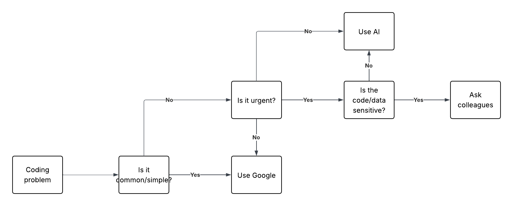

# When to Use Google, AI Tools, or Ask for Help?
## Tasks
### Research best practices for troubleshooting coding problems.
- Understand problem thoroughly
    - Error messages, logs
- Before and after changes
    - Check output before and after changes
    - What change caused the error?
    - What change fixed the error?
- Comment out code
- Use debug tools
- Ask for help
    - From my chat with ChatGPT:
        - AI can boost productivity by writing baseline code, so you can focus on complex code
        - AI can help break down code, explain the problem
        - AI is ineffective at working on more complex and intricate code or code that requires knowledge of company works
        - AI is also not the creative
        - AI can lead to overreliance and detoriating skills
    - People also working on the code

### Develop a decision-making framework
I used [LucidChart](https://lucid.app/lucidchart/3410b195-9b41-4b27-b4dd-b880e27f32c0/edit?viewport_loc=194%2C-155%2C1663%2C789%2C0_0&invitationId=inv_03ba0dd0-d1d2-4d7b-8671-16823750467d) instead as I'm more familiar with it.

## Reflection
### When do you prefer using AI vs. searching Google?
For simpler questions I search Google as there is a high chance that there is an up to date solution for my issue. However, I find AI to be better at harder and not as simple questions. This is because I can question the reponse it gives me and ask it to explain or summarise anything, which is easier than Google where I cannot question the answers.

### How do you decide when to ask a colleague instead?
If we go off of my decision making framework, I will ask a colleague if my issue is more complex, urgent and deals with potentially sensitive data. In some cases if its something I'm unfamiliar with and need something to get me started with then I will also ask.

### What challenges do developers face when troubleshooting alone?
I find that a huge setback for troubleshooting alone is that you have no one else to question you or discuss with you. For example, if I want to solve a problem with an alogrithm, I find it best to discuss with others about the pros and cons and maybe some alternatives. Using AI or Google for this task hinders the creativity needed to innovate a solution.

In the past I've used this decision making framework for group assignments. In a moment where I had to develop a page for our app making sure the page correctly updates items in our backend. I decided that since it wasn't simple, not urgent (I had 2 weeks to do it), then I would use AI for any help.