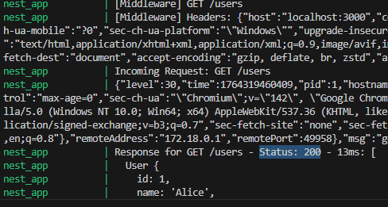

# Inspecting API Requests & Responses
## Tasks
### Research tools for inspecting API requests (Bruno, Postman, or curl)
Bruno
- Stores request "collections" locally
- Has built in tools to inspect requests/responses, headers, etc
- Since its offline, preferred for privacy/data control

Postman
- Allows building, saving, organizing API requests in collections
- Console that logs each request
- Can act as a proxy using its interceptor
- Supports mock servers and scripting inside requests.

curl
- Command line tool that sends requests directly from terminal
- Can be automated
- No GUI, can better understand what exactly is being sent

### Log request payloads and headers in a NestJS controller
I previously created middleware in logging.middleware.ts to globally log requests, I just needed to add a line so that it logs headers too:
```
console.log(`[Middleware] Headers: ${JSON.stringify(req.headers)}`);
```

### Inspect API responses and verify HTTP status codes
I previously created interceptor in logging.interceptor.ts that logged the response, I added HTTP status to it as well.



### Use middleware or interceptors to modify and analyze API responses
As seen in my previous tasks, my middleware and interceptors have logged API responses. In particular the interceptor logged this:
```
Response for GET /users - Status: 200 - 13ms: [
    User {
        id: 1,
        name: 'Alice',
        socialSecurityNumber: undefined,
        creditCardNumber: undefined
    },
    User {
        id: 2,
        name: 'Bob',
        socialSecurityNumber: undefined,
        creditCardNumber: undefined
    }
]
```
This tells me that GET /users was requested. HTTP status 200 tells me it was successful. All the users were also returned which can then be cross checked with the client response.

## Reflection
### How can logging request payloads help with debugging?
Logging requests is useful as you can see what data is being sent, helps with reproducing bugs and can detect any data integrity issues.

### What tools can you use to inspect API requests and responses?
The 3 previously listed tools could be used. Personally I have been using curl as it requires the least amount of work get started with and has really helped me deepen my understanding of API request and responses as I have to manually create requests.

### How would you debug an issue where an API returns the wrong status code?
1. Confirm status code is actually what the server is sending by using a tool
2. Look for any errors in controller methods
3. Check thrown exceptions
4. Check interceptors as they can sometimes unintentionally change or overwrite status codes
5. Check middleware
6. Ensure possible points of error are logged

### What are some security concerns when logging request data?
The biggest concern is accidentally logging sensitive information. As we usually need to be testing sensitive information and how its manipulated, logging it will cause concern. Logs are also saved which can be easily forgotten and someone could gain access to them.