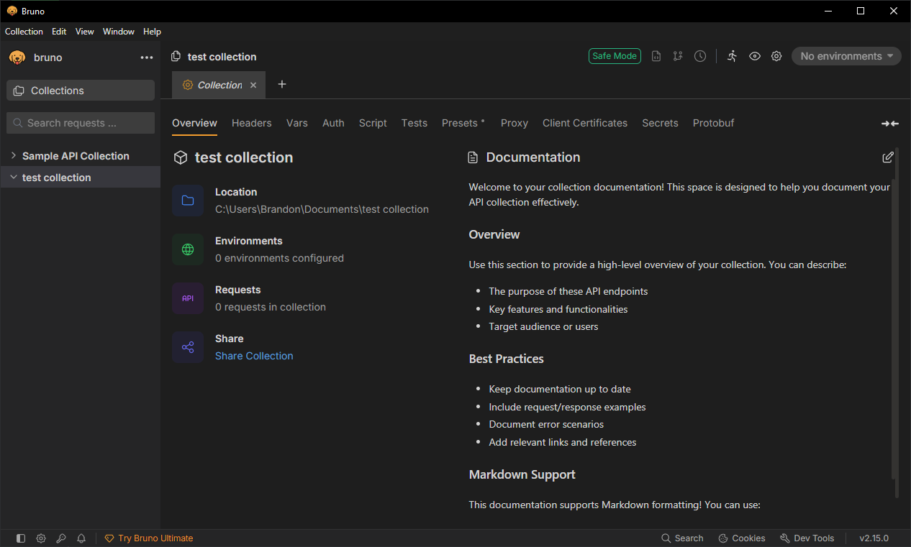
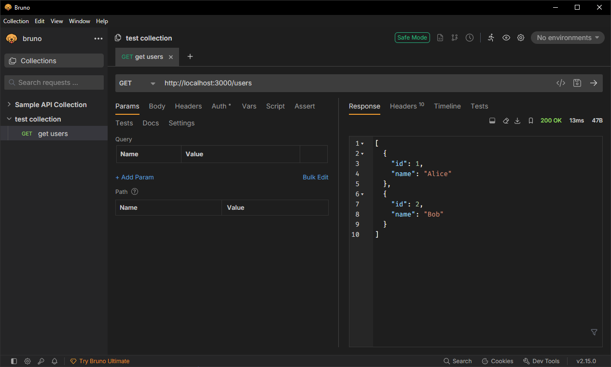

# API Debugging with Bruno
## Tasks
### Research what Bruno is and how it differs from Postman
Bruno is an open source file based API client used for creating, testing, and organizing API requests. Unlike Postman, it is lightweight and privacy focused. It is also git friendly as all requests are stored in a file, rather than large JSONs.

### Install Bruno and create a new API collection
The collection I created is named "test collection".

### Manually add and test a simple public NestJS API endpoint
First I added a new end point to the collection that was just made. Making sure to specify that it was a GET method. I then sent a request through the Bruno app and got the expected return result.

### Explore how to pass headers and authentication tokens in Bruno
For headers, open a collection and there will be a Headers tab. This tab allows you to add keys and values that will automatically be sent in each request of the collection.
For authentication tokens, there is an Auth tab that allows you to add authentication tokens for different types.

## Reflection
### How does Bruno help with API testing compared to Postman or cURL?
I found Bruno to be more useful compared to curl because it has an interactive UI and simplifies the API testing process. Although I found curl really challenged my understanding of API, it become tedious to find commands for simple end point testing. Additionally, Bruno is able to pass headers and authentication tokens which I found challenging with curl. I do not have experience with Postman, but from my research I do not see a reason to use Postman, as Bruno is lightweight, making it easier to share endpoint tests which will be useful at FocusBear.

### How do you send an authenticated request in Bruno?
By adding an authentication token (depending on auth type) in Bruno under then Auth tab. This can be added to collection globally or under a specific request.

### What are the advantages of organizing API requests in collections?
It helps organise requests. For example, I can have a collection for each page of the app or a collection for each user authentication type. It is also useful in collaboration especially in Bruno where requests are stored locally in a folder (collection) and can be committed easily.

### How would you structure a Bruno collection for a NestJS backend project?
As mentioned before, collections for each page would be my choice. I think this would find a nice balance between number of pages (collections) and requests. If in case I find that there are too many requests to test for a page, it could be further organised into features of a page.