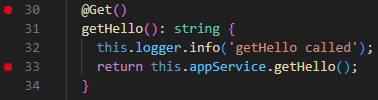
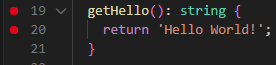

# Debugging with VS Code & Breakpoints
## Tasks
### Research how to configure VS Code debugging for a NestJS project
VS Code can directly attach to Node's debug protocol. Need a launch configuration first. Make sure in tsconfig.json `"sourceMap": true`.

### Set up a launch configuration (launch.json) for debugging
In .vscode/launch.json, the launch config exists. Important to note that `"cwd": "${workspaceFolder}/backend"` because the NestJS is in the backend folder not the root.

### Place breakpoints in a service and controller to inspect request handling
In the controller I put breakpoints at the logger call and service call of the getHello() method.



In the service I put breakpoints at the function and the return of the getHello() method.



### Step through function execution and observe variable values
In particular, I noticed that when the logger was called the logger object was called, then Message logged = "getHello called". This tells me that the logger was ran and logged properly. Then when I stepped through, the service was called and the code jumped to app.service.ts, where the "Hello World!" was returned.

## Reflection
### How do breakpoints help in debugging compared to console logs?
Breakpoints help as they stop code at certain points, allowing for observation of variables and their values. This can help with the debugging process as developers see how variables/values change. Console logs, however, will output variables and their values after the code has ran which makes it harder to see how they changed. An example of this is a loop, where breakpoints will help a developer see a variable's value change throughout all iterations vs console logs where a developer will see what the value is after all iterations of the loop.

### What is the purpose of launch.json, and how does it configure debugging?
`launch.json` defines debug settings for vscode. When debug mode is ran, VS Code will read launch.json and see the configurations that have been set for the repo. In my case, I set the cwd to backend so that VS Code knows that whenever I run debug mode, to run the backend code.

### How can you inspect request parameters and responses while debugging?
Breakpoint must be added at the first line of the method. For example:
```
@Get(':id')
getUser(@Param('id') id: string, @Query('active') active?: boolean) {
  return this.userService.findUser(id, active); // breakpoint on this line
}
```
This will make it so that when VS Code stops there, the request paramaters have just been processed and can be inspected now. Once you completely step through and are out of the method you can see the response value.

### How can you debug background jobs that don’t run in a typical request-response cycle?
They can still be debugged similar to request-response, just ensure the job is triggered then VS Code will stop at the breakpoint. 