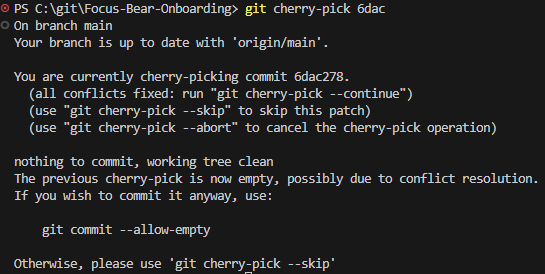

# Merge Conflicts & Conflict Resolution
### Research what causes merge conflicts in Git.
In a situation where you do some work in a branch and the branch is updated before you can merge then there will be a merge conflict if the same file has been updated.
i.e. you are working in an outdated branch.

### Create a merge conflict in your test repo
This was done by
1. Created a file in main called test_conflict.md with some text and commited it
2. Created a branch called test
3. Edited the file by changing some text and committed
4. Merged test into main
A merge conflict will be present now
5. Resolve conflicts in VS Code by accepting either version of test_conflict.md
6. Continue and merge the two branches

### What caused the conflict?
The conflict was caused by the two branches having differing text in test_conflict.md, as such git did not know which one I wanted in the repo.

### How did you resolve it?
Using VS Code in built in conflict resolution I accepted the changes in main, merged the branches locally and then synced them to the cloud.

### What did you learn?
It is important to know how to resolve conflicts as it is not uncommon to experience conflicts. The overall process of merge conflicts was not new to me and I was able to navigate through the through VS Code confliction resolution as I had prior experience with it. In the future I will continue to use my knowledge of merge conflicts to prevent them from happening and resolve them in case they do happen.

# Git Concepts: Staging vs. Committing
## Tasks
### Research the difference between staging and committing.
Staging - Select what changes we want in our next commit
Commit - Save staged changes to the cloud

### Experiment with adding and committing files in your repo using A Git desktop client (e.g., GitHub Desktop, VS Code Git integration).
I normally commit using VS Code, where I typically "Commit and Push" to commit all the changes I currently made. For me, this is easier than working across different files and staging changes that I want to commit.

## Reflection
### What is the difference between staging and committing?
Staging - Marking changes (file changes, deleted files, etc) to be uploaded in the next commit

Commiting - Uploading the currently staged changes to the Git repository.

### Why does Git separate these two steps?
This makes it so that users can easily separate what changes have been made per commit and makes it easier to define in the commit message.

### When would you want to stage changes without committing?
A recent example of mine was when I was working on an assignment and after finishing a task I started another. However, I found an issue with the task I just finished and went back to fix it. If I then commit all my files I would have two files from two different tasks in the same commit and committing them together would make it harder to track the history of them. As such, I staged one and committed that to ensure a clear divide between the commits and what changes have been made within them.

# Creating & Reviewing Pull Requests
## Tasks
### Research what a Pull Request (PR) is and why it’s used.
PR is a request to merge code changes from one branch into another branch. It is used as a buffer before actually merging changes and allows teams to code review, enable CI/CD actions such as linting, document changes and bug fixing.

### Open a Pull Request on GitHub
I created a [PR](https://github.com/brandttru/Focus-Bear-Onboarding/pull/80)

## Reflection
### Why are PRs important in a team workflow?
PRs are especially important because people will be working in different branches at different rates. If we were free to merge branches whenever we wanted to then there would be likely chance of merge conflict on top of different approaches to development, leading to inconsistencies in code. By having PRs code can be reviewed before merge ensuring things such as code correctness, consistency and quality. 

### What makes a well-structured PR?
A well structured PR will have a clear and specific title, concise and informative description that includes context such as the problem, approach, fix and screenshots. Other things such as Asignees, Labels and test coverage will depend on the structure that is enforced.

### What did you learn from reviewing an open-source PR?
I learnt that PRs are sometimes rather small. I had the misconception that a PR be raised when a large feature or bug was fixed. But going through the public PRs of React shows that more often than not PRs are rather small, featuring a couple commits and less than 100 lines changed.

# Writing Meaningful Commit Messages
## Tasks
### Research best practices for writing commit messages.
- Have a subject (like an email)
- Use present tense
- Keep subject and body short
- Don't use full stops
- Metadata if needed
- Keep commits focused on one change
- Use the standard set by the team

### Explore commit histories in an open-source GitHub project (e.g., React, Node.js) and analyze good vs. bad commit messages.
Good - `[test] Fix Error Proxy in Node.js 21+`, includees metadata, is short and focused
Bad - `devtools: fix ellipsis truncation for key values`, metadata goes against standard, all lower case

### Make three commits in your repo with different commit message styles:
- A vague commit message
    - [Fixed mistakes and feedback](https://github.com/brandttru/Focus-Bear-Onboarding/commit/2587d201708ba47a973789e08f4827a9f598ae5a)
- An overly detailed commit message.
    - [Attempted typeorm-encrypted](https://github.com/brandttru/Focus-Bear-Onboarding/commit/ad39c597de4a12535f0b00d0763a8487052387e1)
        - Body includes personal notes which are not needed for the overall history of the project
- A well-structured commit message.
    - [Updated time plan](https://github.com/brandttru/Focus-Bear-Onboarding/commit/7bfbdea01fbaa60fafc99084dd44ef42a7b0b97d)
        - Not the best but its focused and short

### What makes a good commit message?
As previously mentioned in my research for best practices for writing commit messages.

### How does a clear commit message help in team collaboration?
As we work with larger teams, codebases will grow exponentially. As such, having clear commit messages makes it easier to look for commits, easier to understand and overall speeds up the code review process.

### How can poor commit messages cause issues later?
In situations where you have to look through hundreds of commits where each of them are written poorly it can be hard to find certain commits and keep track of the history of the code.

# Branching & Team Collaboration
## Tasks
### Create a new branch in your Git desktop client (e.g., GitHub Desktop, VS Code, SourceTree).
I created a branch named test, using VS Code which I am already familiar with.

### Make a small change in your repo and commit it to the new branch.
I created a file called test_conflict.md and changed the text in the new branch.

### Switch back to main and check that your changes are not there.
Changes would not be in main since they were committed in test.

## Reflection
### Why is pushing directly to main problematic?
Pushing to main makes it harder to track changes, do code reviews and may break production code. Merge conflicts are also very likely, which are tedious to resolve, slowing down development.

### How do branches help with reviewing code?
It allows for developers to review code while other code can be merged into main, keeping production going.

### What happens if two people edit the same file on different branches?
Nothing happens as, they exist in two different areas of the repo but once they are merged into main you may see conflict. This depends on which lines were edited. If the same line was edited in both branches then a conflict will arise.

# Advanced Git Commands & When to Use Them
## Tasks
### Research the following Git commands and test them in your repo:
- `git checkout main -- <file>`
    - This will restore a file from another branch (main in this case) into your working branch
    - I tried it on test_conflict.md, which didn't do anything because the versions are already the same
- `git cherry-pick <commit>`
    - Takes a commit from another branch and applies it to the current branch
    - USEFUL FOR MOVING COMMITS
    - Since I don't have other branches, I tried it with something from main and got this:

    
- `git log`
    - Shows log of commits including authors, dates, messages
    - I tried it and it showed some commits, I had to press enter to scroll through the list
- `git blame <file>`
    - Sees who last modified each line of a file
    - Tried it on generate-keys.js and saw for each line, the commit, my name, date and the code written on each line

## Reflection
### When would you use it in a real project (hint: these are all really important in long running projects with multiple developers)?
I think checkout would be really useful since I often find myself making too many changes that don't even work, so going back to the working version is useful. Cherry-pick, I can see being useful when accidentally working the wrong branch. I've found in the past I often get too focused on the idea of getting a task done but don't remember to branch out. Blame I think would be useful if I notice that a file I made changed. Maybe I want to ask the person who change it why they made certain changes.

### What surprised you while testing these commands?
I was most surprised that these commands existed. I have been using git for a long time and would love to have used these in the past. Cherry-pick especially would be useful for ensuring commits are tracked correctly and in the right branch.