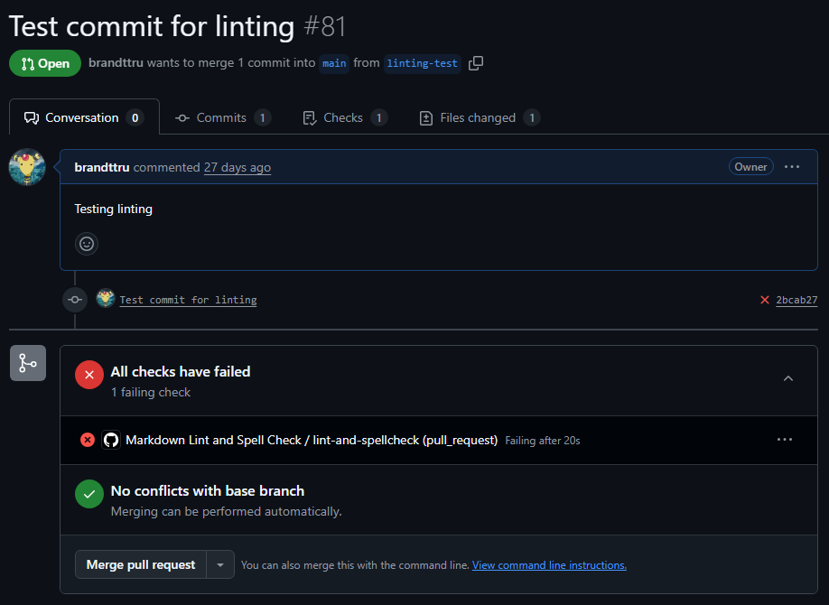

# Static Analysis Checks in CI/CD
## Tasks
### Research what CI/CD is and why it’s used in software development.
Continuous Integration and Continuous Deployment. It refers to automating building, testing and deploying. Part of it is making sure the code that we want to pull in is up to standard. It's useful as it helps catch formatting errors, inconsistencies, bugs, etc.

### Set up a CI workflow that runs Markdown linting and spell checks on PRs in your repo.
In .github/workflows/linting.yml, I created the CI workflow file which tells GitHub actions to run Markdown linter and spell checker on every PR I make.

### Experiment with Git Hooks (e.g., Husky) to enforce linting before commits.
Using `npx husky add .husky/pre-commit "npm run lint"` I created a hook to enforce linting before a commit

### Open a test PR in your repository and review the automated checks.
In this [PR](https://github.com/brandttru/Focus-Bear-Onboarding/pull/81), I intentionally made errors and as expected, linting check failed as I had a spelling error. If I wanted it to pass I should have used `npm run lint`.

## Reflection
### What is the purpose of CI/CD?
CI/CD's purpose is to automate QA checks in code. This can include formatting, test cases, and spell checks. This streamlines the development process, ensuring that each change is testing and check before deployment.

### How does automating style checks improve project quality?
By integrating style checks, it ensures that code is consistent across the code base. When there are many developers working on the same project it can be hard for all of them to consciously apply the same coing standards. Thus, the style checks will ensure consistency across the code base.

### What are some challenges with enforcing checks in CI/CD?
Some challenges are:
- Slower deployment time
    - Changes must satisfy checks before being merged
- Overly strict rules
    - Some rules may end up being restrictive to the code and hinder development
- Maintenance
    - As the code base grows, the rules must all remain up to date

Personally in the past I found that although it can be frustrating at times, keeping code consistency was very important for working with large teams and it really made maintenance and scalability easier. It's also very easy to just run `npm run format` to cleanly format code.

### How do CI/CD pipelines differ between small projects and large teams?
In smaller projects you can expect one YAML file to test and few pipelines used to focus on speed and simplicity. Whereas in larger projects you can expect multiple pipelines with several workflows, as well as multiple tools in order to run a scalable and a reliable CI/CD pipeline.
