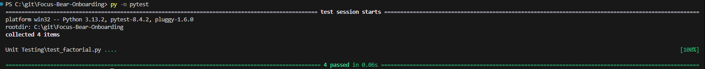
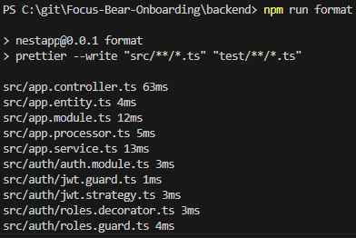

# Understanding Clean Code Principles
### Research and summarize the following clean code principles
Simplicty
- Code should be as simple as possible
- Makes it easier to understand, debug and maintain

Readability
- Code should be easy to read and understand
- Improves collaboration and reduces mistakes

Maintainability
- Code be easy to extend and modify in the future
- Ensures long term project growth and reduces technical debt

Consistency
- Follow established standards and conventions
- Consistent code is easier to maintain and understand

Efficiency
- Code should be optimized as much as possible and not be complicated
- Ensures better performance and resource usage

### Find an example of messy code online (or write one yourself) and describe why it's difficult to read.
Generated using ChatGPT
```
def x(a, b):
    if a > b:
        return a - b
    else:
        return b - a

y = x(10, 3)
print(y)
```

A few reasons why this is bad is:
- Bad variable names
    - Variable names should have meaning
- Unnecessary if else statement
    - The if else statement can be simplified

### Rewrite the code in a cleaner, more structured way.
```
def difference(num1, num2):
    return abs(num1 - num2)

result = difference(10, 3)
print(result)
```

# Naming Variables & Functions
### Find examples of unclear variable names in an existing codebase (or write your own).
Using the same example from before
```
def x(a, b):
    if a > b:
        return a - b
    else:
        return b - a

y = x(10, 3)
print(y)
```

### Refactor the code by renaming variables/functions for better clarity.
```
def difference(num1, num2):
    if num1 > num2:
        return num1 - num2
    else:
        return num2 - num1

result = difference(10, 3)
print(result)
```

### What makes a good variable or function name?
A good variable is one that is easy to understand by anyone, not just the person working on it. It also makes it clear what it represents. In the previous example the function is used to find the difference between two numbers. "x" does not tell me what its supposed to do, whereas "difference" tells me it finds the difference between two numbers.

### What issues can arise from poorly named variables?
When working with large code bases, it can be hard to keep track of variables as they are constantly changing throughout the code. Without meaningful names, it can be very hard to debug. For example you might see that variable "h" is returning null, but what is "h"? Having proper names removes this issue entirely.

### How did refactoring improve code readability?
Refactoring made it easier to read and keep track of whats happening in the code. In the original code, it is hard to initially figure out what the function was trying to do as well as what was happening with the parameters. Refactoring made it easier for me understand what was the original intention and keep track of what was happening to the parameters throughout the function.

# Writing Small, Focused Functions
### Find an example of a long, complex function in an existing codebase (or write your own).
Generated using ChatGPT
```
def process_orders(orders, inventory, discount_codes, shipping_rates):
    total_revenue = 0
    shipped_orders = []
    for order in orders:
        order_total = 0
        for item in order['items']:
            if item['id'] in inventory and inventory[item['id']] > 0:
                price = item['price']
                quantity = item['quantity']
                if item['id'] in discount_codes:
                    price *= 0.9  # apply discount
                if quantity > inventory[item['id']]:
                    quantity = inventory[item['id']]
                inventory[item['id']] -= quantity
                order_total += price * quantity
            else:
                print(f"Item {item['id']} is out of stock")
        if order_total > 100:
            shipping_cost = 0
        else:
            shipping_cost = shipping_rates.get(order['region'], 10)
        order_total += shipping_cost
        total_revenue += order_total
        if order_total > 0:
            shipped_orders.append({
                'order_id': order['id'],
                'total': order_total,
                'items': order['items'],
                'shipping': shipping_cost
            })
    print(f"Processed {len(shipped_orders)} orders, total revenue: {total_revenue}")
    return shipped_orders, total_revenue
```

### Refactor it into multiple smaller functions with clear responsibilities.
```
def apply_discount(item, discount_codes):
    """Calculate price after discount if applicable."""
    price = item['price']
    if item['id'] in discount_codes:
        price *= 0.9  # 10% discount
    return price

def adjust_quantity(item, inventory):
    """Ensure the quantity does not exceed inventory and update stock."""
    available = inventory.get(item['id'], 0)
    quantity = min(item['quantity'], available)
    inventory[item['id']] = available - quantity
    return quantity

def calculate_order_total(order, inventory, discount_codes):
    """Calculate total cost of items in the order."""
    total = 0
    for item in order['items']:
        if inventory.get(item['id'], 0) > 0:
            price = apply_discount(item, discount_codes)
            quantity = adjust_quantity(item, inventory)
            total += price * quantity
        else:
            print(f"Item {item['id']} is out of stock")
    return total

def calculate_shipping(order_total, region, shipping_rates):
    """Determine shipping cost based on total and region."""
    if order_total > 100:
        return 0
    return shipping_rates.get(region, 10)

def process_orders(orders, inventory, discount_codes, shipping_rates):
    """Process a list of orders and return shipped orders with total revenue."""
    total_revenue = 0
    shipped_orders = []

    for order in orders:
        order_total = calculate_order_total(order, inventory, discount_codes)
        shipping_cost = calculate_shipping(order_total, order['region'], shipping_rates)
        order_total += shipping_cost
        total_revenue += order_total

        if order_total > 0:
            shipped_orders.append({
                'order_id': order['id'],
                'total': order_total,
                'items': order['items'],
                'shipping': shipping_cost
            })

    print(f"Processed {len(shipped_orders)} orders, total revenue: {total_revenue}")
    return shipped_orders, total_revenue
```

### Why is breaking down functions beneficial?
Breaking down functions is good because:
- It is easier to read
- Easier to make changes to smaller individual functions than one huge one
- Smaller functions can be tested
- Small functions can be reused in other parts of code

### How did refactoring improve the structure of the code?
It made the function overall have less responsiblity, insteading breaking it up into difference sections that can then be reused in other parts of code. It also made it easier to read and maintain as well. At first I had no idea what exactly was happening in process_orders, but once it was broken up I understood what steps were needed to process an order. This is great for collaboration as you want other people to be able to quickly understand your code and get working on it.

# Avoiding Code Duplication
### Research the "Don't Repeat Yourself" (DRY) principle.
DRY refers to the expectation that you minimise copying code throughout a codebase. It ensures that code is cleaner, simplier to read and more flexible in terms of extension.

### Example of DRY code
An example of DRY code can be found [here](https://gist.githubusercontent.com/NyaGarcia/7f19fcd5211dc9b99fa1a957c9219f68/raw/f7d2f7b71393bc07d8731a087fd043d0f982d5fd/duplication.js)
```
function getJavascriptNews() {
    const allNews = getNewsFromWeb();
    const news = [];
 
    for (let i = allNews.length - 1; i >= 0; i--){
        if (allNews[i].type === "javascript") {
            news.push(allNews[i]);
        }
    }
 
    return news;
}
 
function getRustNews() {
    const allNews = getNewsFromWeb();
    const news = [];
 
    for (let i = allNews.length - 1; i >= 0; i--){
        if (allNews[i].type === "rust") {
            news.push(allNews[i]);
        }
    }
 
    return news;
}

function getGolangNews() {
  const news = [];
  const allNews = getNewsFromWeb();

  for (let i = allNews.length - 1; i >= 0; i--) {
    if (allNews[i].type === 'golang') {
      news.push(allNews[i]);
    }
  }

  return news;
}
```

### What were the issues with duplicated code?
The reason why this code violates DRY is that it copy and pastes the same code while only making minimal changes. All these functions serve a similar purpose (getting the type of news) and as such it is unnecessary to repeat them. Combing these into one function and can improve reusability and scalability.

### How did refactoring improve maintainability?
```
function getNewsByType(type) {
  const allNews = getNewsFromWeb();
  const news = [];

  for (let i = allNews.length - 1; i >= 0; i--) {
    if (allNews[i].type === type) {
      news.push(allNews[i]);
    }
  }

  return news;
}
```

By making use of parameters, we can instead refactor the function to be accepting of any new types of news. This means that any other types of news besides the previous 3 can be retrieved without having to make new functions each time. Overall, the code is much more scalable.

# Refactoring Code for Simplicity
### Find an example of overly complicated code in an existing project (or write your own).
I wrote my own code for returning error status messages.
```
function getStatusMessage(code) {
  if (code === 200) {
    return "OK";
  } else {
    if (code === 400) {
      return "Bad Request";
    } else {
      if (code === 404) {
        return "Not Found";
      } else {
        if (code === 500) {
          return "Server Error";
        } else {
          return "Unknown";
        }
      }
    }
  }
}
```

### What made the original code complex?
This is more complex than necessary because it is over engineered. There are unnecessary conditions if else statements that are also nested within each other. This makes it harder to read the code and in more complex code can make it harder to understand, hindering development process.

### How did refactoring improve it?
```
function getStatusMessage(code) {
  const messages = {
    200: "OK",
    400: "Bad Request",
    404: "Not Found",
    500: "Server Error",
  };

  return messages[code] || "Unknown";
}
```

Refactoring has made it a lot simpler, removing the nested ifs and also the unnecessary conditions. From the refactored version it is easier to see which error number corresponds to which message. Indentation in this function also makes it a lot easier to read. The function is now easier to read and it is easier to see what the expected outcome would/should be.

# Commenting & Documentation
### Find an example of poorly commented code and rewrite the comments to be more useful.
An example of poorly commented code can be found [here](https://refine.dev/blog/code-comments/#the-bad-when-comments-are-a-liability).
```
// This is a class for a Car
class Car {
  // constructor
  constructor() {
    // ...
  }
}
```

Can be improved by
```
class Car {
  constructor() {
    // ...
  }
}
```
We do not need to state the obvious when commenting. Comments in the constructor may be useful here depending on any inheritance, again this should be used sparringly and not state the obvious.

### When should you add comments?
Comments should only be added when necessary. Such as when it may be hard to understand what part of the code is doing what or it is unclear why you do something. They shouldn't constantly be used as it will reduce readability of code.

### When should you avoid comments and instead improve the code?
When you find that you have to constantly comment so that you can understand the code, then you should consider whether there is an easier way to code your design. An example is if you have a complex function that can be broken up into other functions. The names of these functions can help describe what is going on rather than just relying on a large function with comments in it. Another time you should improve code is if you are using magic numbers/strings since you can use named variables instead of using comments to describe the values used (this also has the added bonus of making refactoring and bug fixing easier).

# Handling Errors & Edge Cases
### Research strategies for handling errors and edge cases in code (include Guard Clauses).
- Guard Clauses
    - Checks at the start of a function to handle invalid inputs or edge cases
- Input validation
    - Checks if input is valid before proceeding with function
- Try-Catch/Try-Except
    - Handles exceptions and prevent crashes 
- Default values
    - Provides default values to avoid error 

### Find an existing function that doesn’t properly handle errors or invalid inputs.
```
def divide_numbers(a, b):
    return a / b
```

### What was the issue with the original code?
The issue with this code is that it does not handle errors properly and can crash the system. For example, if you input b=0 then you cannot divide by 0 and the code will crash.

### Refactor the function to improve error handling.
```
def divide_numbers(a, b):
    # Guard clauses: check for invalid inputs
    if not isinstance(a, (int, float)):
        raise TypeError(f"Invalid input: a must be a number, got {type(a).__name__}")
    if not isinstance(b, (int, float)):
        raise TypeError(f"Invalid input: b must be a number, got {type(b).__name__}")
    if b == 0:
        raise ValueError("Division by zero is not allowed")

    # Safe division
    return a / b
```
The code now is able to check for if inputs are numbers, as well as if b=0, thus preventing any chance of the code crashing

### How does handling errors improve reliability?
Handling errors makes code more reliable as it can provide predictable behaviour. In the example, a user would expect the system to not be able to divide by 0 and thus by having that error handling, a user's experience is not affected as it was the expected behaviour. It can also make debugging easier when we know where errors could occur and what errors specifically.

# Writing Unit Tests for Clean Code
### Choose a testing framework
I will be using pytest for my tests of Unit Testing/factorial.py. The tests can be found in test_factorial.py

### Write a few unit tests for a function in your test repo.
I have created some basic tests for returning the factorial of an input.
```
def test_factorial_basic(): // normal inputs
    assert factorial(0) == 1
    assert factorial(1) == 1
    assert factorial(5) == 120
    assert factorial(7) == 5040

def test_factorial_large_number(): // edge case
    assert factorial(10) == 3628800

def test_factorial_invalid_type(): // error case
    with pytest.raises(ValueError, match="Input must be an integer."):
        factorial(5.5)

def test_factorial_negative_input(): // error case
    with pytest.raises(ValueError, match="Input must be non-negative."):
        factorial(-3)
```

The output of the test looks like this and all tests passed.


### How do unit tests help keep code clean?
Unit tests are important as they can help discern any problematic code and encourage refactoring of code. For example, testing a large function can reveal it has too many responsibilities and dependencies and as such it may be better to break it down by responsibility. It can also catch edge cases, thus encouraging a developer to write better code that can handle edge cases.

### What issues did you find while testing?
I did not find any specific issues with the tests and code, but I did have trouble with the set up of pytest. Initially, I was unable to install pytest due to issues with where python was located. This was an issue as without fixing this, I could not test the code at all.

# Code Formatting & Style Guides
## Tasks
### Run the formatter and linter on your codebase and fix any issues.
Before formatting:
```
function sayHello(name){console.log("Hello, "+name+"!");}
const people=["Alice","Bob","Charlie"]
for(let i=0;i<people.length;i++){sayHello(people[i])}
if(people.length>2){console.log("That's a lot of people!")}
```

After formatting: 
```
function sayHello(name) {
  console.log("Hello, " + name + "!");
}

const people = ["Alice", "Bob", "Charlie"];

for (let i = 0; i < people.length; i++) {
  sayHello(people[i]);
}

if (people.length > 2) {
  console.log("That's a lot of people!");
}
```
### Install and configure ESLint and Prettier in your development environment.
ESLint and Prettier were installed and automatically setup.

### Run the formatter and linter on your codebase and fix any issues.
I ran formatter using `npm run format` and it automatically formmatted all of my files.


## Reflection
### Why is code formatting important?
It helps improve readability of code. This can then make it easier for future developers to read your code and understand its intent.

### What issues did the linter detect?
The linter detected issues such indenting, inconsistent quotation marks and missing new lines.

### Did formatting the code make it easier to read?
Formatting did make the code easier to read. For the functions and if statements it makes it easier to see which lines of code belongs to which as well as making it easier to see where the statements end.