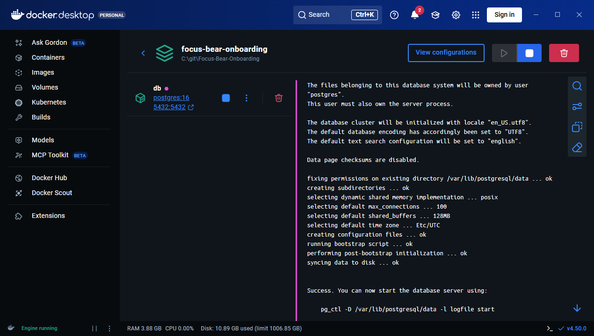
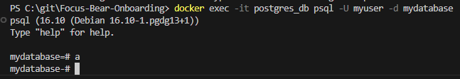

# Running PostgreSQL in Docker
## Tasks
Composed container

Connected to psql shell inside container

## Reflection
### What are the benefits of running PostgreSQL in a Docker container?
It allows PostgreSQL to be used without having to install it, making it easier to setup. It also ensures it works consistently across machines as you don't run into issues with how it is installed onto different OS.

### How do Docker volumes help persist PostgreSQL data?
Without volumes, any data written will be written to the instance of the container. This means it is susceptible to data loss when the container is restarted or composed down.

### How can you connect to a running PostgreSQL container
You can use `docker exec` to run psql within the container or use a GUI client to to connect to the container by host, port, user, password, and database.