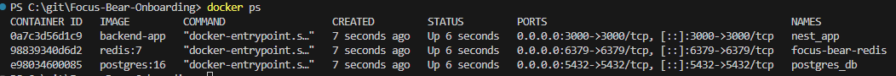
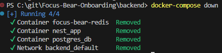

# Setting Up Docker and Docker Compose
## Tasks
### Verify Docker installation and check running services
Using `docker --version`, I am told I have Docker version 28.5.1, build e180ab8. `docker ps` also tells me what containers I have active:

### Learn key Docker commands (docker ps, docker stop, docker logs, etc.)
`docker ps` - shows current active containers
`docker stop` - stops an active container
`docker logs` - shows logs for an active container
`docker-compose down` - composes down the active container

Here's me using `docker-compose down` in terminal:

### Explore how Docker Compose simplifies multi-container setups
By defining a docker-compose.yml, you can specify what containers to link together and run together. This saves the effort of using `docker run` for each individual container. Very useful in my case where I have 3 different containers I need to run.

## Reflection
### What is the difference between docker run and docker-compose up?
`docker run` runs a single container manually, whereas `docker-compose up` will run multiple containers as defined in docker-compose.yml

### How does Docker Compose help when working with multiple services?
Compose is useful when working with multiple services as it allows multiple services to be ran from a single file. This makes the process of running docker containers more convenient.

### What commands can you use to check logs from a running container?
`docker-compose logs` can check logs. To view logs in real time add the `-f` flag.

### What happens when you restart a container? Does data persist?
Any data written within the container's writable layer does get deleted when the container is restarted. But data written to volume or bind mount will be persistent.