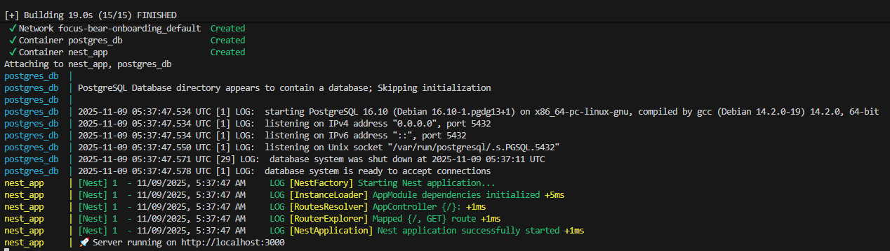

# Using Docker for NestJS Development
## Tasks
### Research how to create a Dockerfile for a NestJS app
From the NestJS site, the folling steps will Dockerize a NestJS app
```
# Use the official Node.js image as the base image
FROM node:20

# Set the working directory inside the container
WORKDIR /usr/src/app

# Copy package.json and package-lock.json to the working directory
COPY package*.json ./

# Install the application dependencies
RUN npm install

# Copy the rest of the application files
COPY . .

# Build the NestJS application
RUN npm run build

# Expose the application port
EXPOSE 3000

# Command to run the application
CMD ["node", "dist/main"]
```

### Understand multi-stage builds for smaller, optimized images
Dockerfile has multiple `FROM` statements, files can be copied between stages and build process can be separated.
“Use one image to compile and build everything — then copy only the results into a much smaller image for running.”

### Test the setup by running both containers and checking API connectivity
 

## Reflection
### How does a Dockerfile define a containerized NestJS application?
A multi stage build is required to build a NestJS app, as such it will copy files from different stages of the build into a single image

### What is the purpose of a multi-stage build in Docker?
To keep the final image small. Things like dependency installation will be done outside of the image, and only the results will copied into the final image.

### How does Docker Compose simplify running multiple services together?
Docker compose makes the process more convenient as it allows multiple containers to be managed within one yml file instead of running multiple Docker commands.

### How can you expose API logs and debug a running container?
If the app does have logs, `docker logs` can see those logs in real time, making it easier to spot where bugs are. You can also `docker exec` to enter the shell of the container and inspect filesystem or test network connectivity