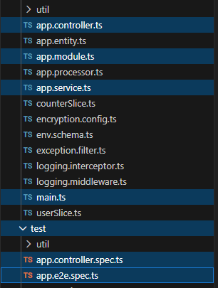

# What is NestJS? (Framework Overview)
## Tasks
### Explore NestJS’s modular architecture (Modules, Controllers, Services)
- Modules
    - Contain functionality of different parts of the app
- Controllers
    - Handle incoming HTTP requests and outgoing responses
- Services
    - Handle business logic and data manipulation, used by controllers

Here is an example of my project structure with the different modules, controllers and services:



### Find out how decorators (@Controller(), @Injectable()) work in NestJS
- `@Controller`
    - Marks a class as a controller that will handle incoming and outgoing HTTP requests
- `@Injectable`
    - Marks a class as a provider that can be injected into another class that depends on it

## Reflection
### What are the key differences between NestJS and Express.js?
NestJS is an open source framework that builds scalable Node.js server-side applications. It uses type script with three main components: controllers, modules, providers.
Similarly, Express.js, is a framework that builds apps. Where it differs is that Express.js uses JavaScript in addition to Node.js and does not follow the MVC architecture. Additionally, it does not have dependency injection and does not have a defined structure. 

NestJS also mentions in their Controllers, Providers (Services), and Modules sections that NestJS’s dependency injection container automatically resolves provider instances when declared in a constructor. For example, if I wanted to inject my app.service.ts into app.controller.ts all I have to do is add the decorator and then declare it in the controller's constructor, without having to instantiate it prior. Here is what my controller looks like:

```
@Controller()
export class AppController {
  constructor(
    private readonly appService: AppService, // here I'm declaring it without instantiation.
    private readonly logger: PinoLogger,
  ) {}
}
```

### Why does NestJS use decorators extensively?
Decorators define what the code should do. Instead of having to write procedural code or dependency injection, decorators can be used instead that functionality. NestJS uses a TypeScript Library to store and retrieve metadata about classes, methods, and properties at runtime. It also makes it easier to understand what class is a controller, what is injectable, etc.

### How does NestJS handle dependency injection?
NestJS uses a Inversion of Control (IoC) container which manages the representation and injection of dependencies. With the `@Injectable` decorator, classes marked become a provider that can be injected into other classes. These dependencies are specified in the constructor of a class, and the IoC container resolves them at runtime.

### What benefits does modular architecture provide in a large-scale app?
When building large-scale apps where there are lots of changing parts, modular architecture can ensure maintainability as dependencies can be injected. This results in scalable and reusable modules which can making testing easier and thus improve collaboration.