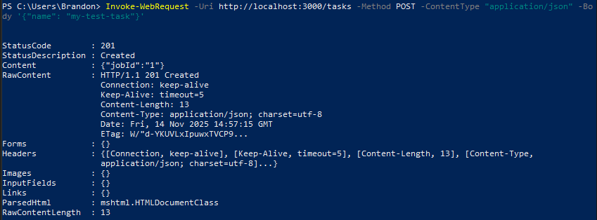
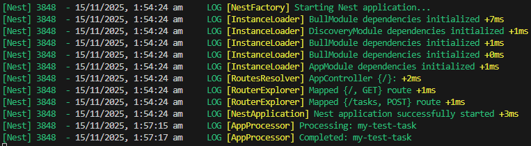

# Background Jobs with BullMQ & Redis in NestJS
## Tasks
### Research how BullMQ works and why it's useful for background processing
BullMQ is built on Redis that implements job queues to do background processing.
How it works:
    - Queue instance created, producers add jobs to it
    - Jobs are units of work
    - One or more worker processes subscribe to a queue and process jobs asynchronously
    - Jobs move between states like waiting -> active -> completed -> failed
        - Hooks/events can monitor or add logic to these states
It is useful because it offloads tasks to the background. It is scalable as workers can be created to handle additional job queues. It is reliable as it jobs persist. 

### Create a simple job queue and process a background task
By sending this request:

A task was put into the queue and processed:

### Explore how Redis stores and manages queued jobs
Redis stores jobs in a Redis queue and uses certain commands to manage where in the queue jobs are stored. `LPUSH` pushes a job to the head of the queue, `RPOP` to pop the job at the end of the queue.

## Reflection
### Why is BullMQ used instead of handling tasks directly in API requests?
Because of its use of queues, BullMQ is quicker at handling tasks, whereas API handling inline can block the request. BullMQ is also more scalable as workers can be added to handle multiple requests and they can be scaled independently depending on workload.

### How does Redis help manage job queues in BullMQ?
Redis's data structure is responsible for the actual queueing of jobs in BullMQ. Since Redis supports atomic commands, multiple operations can be done without race conditions.

### What happens if a job fails? How can failed jobs be retried?
THe job will move to the failed list where it can be restarted. During this time workers will continue processing other jobs without any blockers. BullMQ allows for specification to retry a job automatically, otherwise it will remain in the failed list.

### How does Focus Bear use BullMQ for background tasks?
BullMQ would be used for time consuming tasks such as sending notifications, processing analytics or syncing data. This is useful as it does not take up time from a user request, improving app responsiveness and reliability.