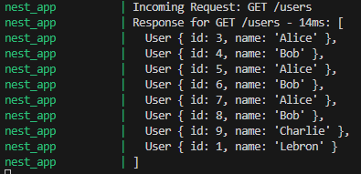
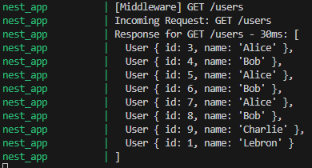

# Using Interceptors & Middleware in NestJS
## Tasks
### Explore built-in interceptors like ClassSerializerInterceptor
Built in interceptors handle common concerns such as serializaiton, logging, caching and timeout.
`ClassSerializerInterceptor` automatically transforms and serialises class instances being returned by controller before sending them as HTTP responses. This is used because returned class instances are sent as raw JSON, which means fields are exposed unintentionally. The interceptor will prevent and allow certain things from being returned.

### Implement a simple logging interceptor to log request and response data
The logging interceptor can be found in logging.interceptor.ts and it was applied globally in app.module.ts
```
@Injectable()
export class LoggingInterceptor implements NestInterceptor {
  intercept(context: ExecutionContext, next: CallHandler): Observable<any> {
    const req = context.switchToHttp().getRequest();
    const res = context.switchToHttp().getResponse();
    const method = req.method;
    const url = req.url;

    console.log(`Incoming Request: ${method} ${url}`);

    const now = Date.now();

    return next.handle().pipe(
      tap((responseData) => {
        const responseTime = Date.now() - now;
        const statusCode = res.statusCode;
        console.log(
          `Response for ${method} ${url} - Status: ${statusCode} - ${responseTime}ms:`,
          responseData,
        );
      }),
    );
  }
}
```

To test it I sent a response to getUsers(). It responded with all the users in terminal, showing that this is the data we expect from this route.



### Create a middleware function and apply it globally or to specific routes
The middleware can be found in logging.middleware.ts and it was applied globally in app.module.ts.
```
@Injectable()
export class LoggingMiddleware implements NestMiddleware {
  use(req: Request, res: Response, next: NextFunction) {
    console.log(`[Middleware] ${req.method} ${req.originalUrl}`);
    console.log(`[Middleware] Headers: ${JSON.stringify(req.headers)}`);
    next();
  }
}
```

It is important that '*' is passed in forRoutes() to ensure the middleware is active for all routes.
```
export class AppModule implements NestModule {
  configure(consumer: MiddlewareConsumer) {
    consumer.apply(LoggingMiddleware).forRoutes('*'); // all routes
  }
}
```

Middleware working in tandem with interceptor and its reponse is shown in the below screenshot. Middleware logs can be identified by the [Middleware] tag.



## Reflection
### What is the difference between an interceptor and middleware in NestJS?
- Interceptors
    - Run before and after route handler (controller) is called
    - Handles incoming request and outgoing response
    - Used for response mapping, caching, timeout handling, additional logic around the actual method execution
    - Think of it as A wrapper around controller method execution.
- Middleware
    - Runs before the route handler (controller) is called
    - Used for logging, authentication, request shaping, body parsing
    - Think of it as Pre-processing the request before it reaches your controllers

### When would you use an interceptor instead of middleware?
Interceptors should be used when you need to manipulate data before it is sent back to the client. For example, API responses should never send back the user's sensitive information as this poses a security risk.

### How does LoggerErrorInterceptor help?
`LoggerErrorInterceptor` is useful as it can catch errors before they are sent out, logs details and if needed modify the error response. This helps in testing and debugging.