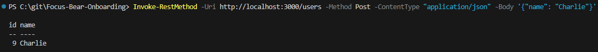
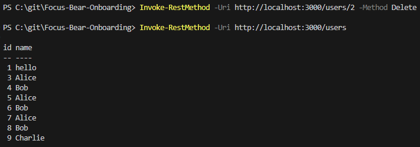
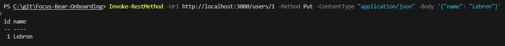

# Creating REST APIs with NestJS
## Tasks
### Research how REST APIs are structured in NestJS
Controllers use HTTP decorators to define route handling

### Test the endpoints using a tool like Postman or cURL
Create new user:

Get all users:

Delete user:

Update user:

## Reflection
### What is the role of a controller in NestJS?
Controllers handle incoming HTTP requests and their responses. They act as entry points for API

### How should business logic be separated from the controller?
Controllers = Handle HTTP requests/responses
Services = Contain business logic
Repositories = Handle database operations

We need to make sure controllers just call the relevant functions (that contain business logic) from the service that is injected.

### Why is it important to use services instead of handling logic inside controllers?
It streamlines the development cycle, as controllers will be focused on requests, they can be tested for responses without worrying about logic. Services can then be bug fixed depending on the logic and without worrying about responses. This separation defines clear focus when testing controllers/services. This also improves maintainability and reusability.

### How does NestJS automatically map request methods (GET, POST, etc.) to handlers?
This is done through using decorators that define a handler by its request type.