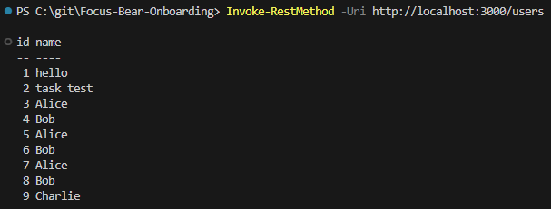

# Connecting to PostgreSQL with TypeORM in NestJS
## Tasks
### Research how TypeORM integrates with NestJS (@nestjs/typeorm)
It is a integration package for TypeORM in NestJS projects. It connects to and handles requests to database.

First a database connection must be made in module. Then an entity(table) must be created. Then it can be inserted into a service as a repository. From there, the data within the table can be manipulated.

### Set up a database connection in NestJS
Set up and repository creation was previously done in typeorm-migrations.md. The TypeORM configuration can be found in app.module.ts
```
TypeOrmModule.forRootAsync({
  useFactory: (config: ConfigService) => ({
    type: 'postgres',
    host: config.get('DB_HOST'),
    port: config.get<number>('DB_PORT'),
    username: config.get('DB_USER'),
    password: config.get('DB_PASS'),
    database: config.get('DB_NAME'),
    autoLoadEntities: true,
    synchronize: true,
  }),
  inject: [ConfigService],
}),
```

### Create an entity and repository to interact with PostgreSQL
The entity created is found in app.entity.ts. This entity stores user data.
```
@Entity()
export class User {
  @PrimaryGeneratedColumn()
  id: number;

  @Column()
  name: string;

  @Column()
  socialSecurityNumber: string;

  @Column()
  creditCardNumber: string;
}
```

### Perform basic database operations (CRUD) using TypeORM
If you curl /users (command shown in screenshot), you will get the list of all users as defined in the controller.
```
  @Get('users')
  async getAllUsers() {
    this.logger.info('getAllUsers called');
    return this.appService.getAllUsers();
  }
```



## Reflection
### How does @nestjs/typeorm simplify database interactions?
`@nestjs/typeorm` handles connection to the database and automates it. It also has dependency injection which makes it easy to manipulate data through services. It also ensures the modular architecture of NestJS is upheld when integrating database interaction.

### What is the difference between an entity and a repository in TypeORM?
An entity is a class that defines what a table looks like in the database. The repository is the actual instance of the table that can be manipulated.

### How does TypeORM handle migrations in a NestJS project?
In a NestJS project, TypeORM will run migrations outside the NestJS runtime. 

### What are the advantages of using PostgreSQL over other databases in a NestJS app?
PostgreSQL is preferred because it supports advanced data types (JSONB, arrays, enums, etc), is strict with constraints to ensure data consistency, has support for TypeORM.