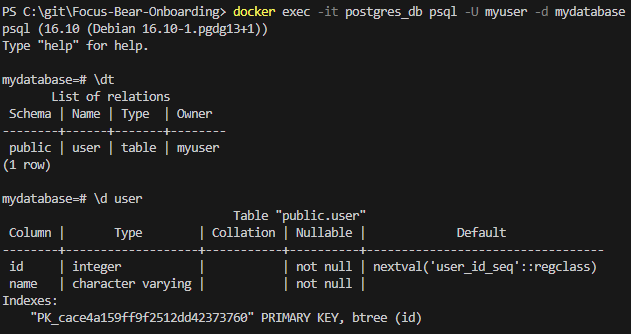
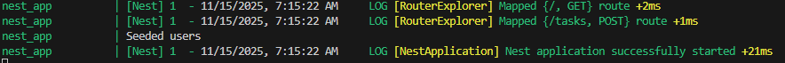
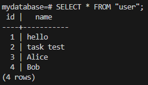

# Seeding & Migrations in TypeORM
## Tasks
### Research how migrations work in TypeORM (typeorm migration:generate)
A migration is just a single file with SQL queries to update a database schema and apply new changes to an existing database.
`typeorm migration:generate` - reads TypeORM config, connects to database, loads and parses entity classes and then compares exisiting database to changes made, then makes a schema file with the changes

### Create a new migration and apply it to the database
A migration to add to the user table was created

### Seed sample data into PostgreSQL using TypeORM repositories
Seeded data is done on initialisation

Seeded data in the table looks like:

### Explore how migrations can be used to roll back database changes
Normally `up` method will apply changes. These can be rolled back with `down`

## Reflections
### What is the purpose of database migrations in TypeORM?
Migrations serve as version control for the database. It can manage schema changes safely, sync schema across environments and automate deployment of database updates.

### How do migrations differ from seeding?
Migrations apply changes to the database schema (database structure, table columns etc), whereas seeding populates the database with sample data.

### Why is it important to version-control database schema changes?
Due to multiple people accessing the database at a time, it ensures consistent changes without any data overwrite or duplication. It also allows for rollback in case these mistakes are made and data is inconsistent.

### How can you roll back a migration if an issue occurs?
`typeorm migration:revert` runs the down method of the most recently applied migration. As such, it is important that down methods are implemented to ensure rollback is possible.