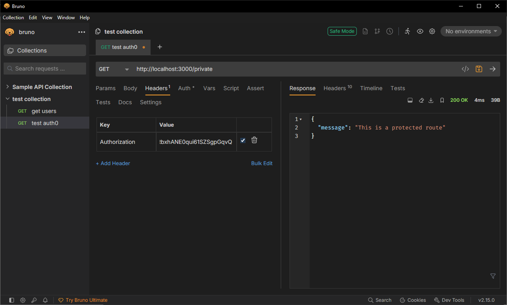

# Authentication in NestJS with Auth0 & JWT
## Tasks
### Research how Auth0 integrates with NestJS (auth0, @nestjs/jwt, jwks-rsa)
`auth0` is a program that integrates authentication into a NestJS app.
`nestjs/jwt` is a package used to implement JWT based authentication. JSON web token (JWT) pass information via JSON, usually used for authentication.
`jwks-rsa` is a library to retrieve RSA public keys from a JWKS endpoint. This is used because auth0 uses rotating RSA keys. Tokens should be validated against public keys from JWKS.

### Understand how JWT-based authentication works
JWT (JSON Web Token) authentication is a stateless way for a server to verify a user’s identity using a digitally signed token. \
JWT has 3 parts:
1. Header - tells you the algorithm used to sign the token
2. Payload - JSON object containing information about the user
3. Signature - created using signing algorithm and a private key

### Explore how Auth0 manages user sessions and access tokens
Auth0 sets a session cookie after login to handle user sessions, allowing users to be authenticated. Access tokens, once logged in, are sent to API and contains the users permissions and ID. They are used together for authentication. If access token expires, so long as sessions is still active then another access token can be generated that way the user does not need to login again. Once session expires the user must login again.

### Set up a simple authentication flow using Auth0 in a NestJS app
Previous steps to creating an auth API in auth0 were done in nestjs-rbac.md where I found the auth0 domain and audience.

First I created auth.module.ts as the module for authentication. Then I needed to create a JWT strategy in jwt.strategy.ts in order to validate the JWT. I then created a test controller that contains a route to 'private'. To test, I used Bruno where I created a request with header for an authorised token. Once the request was sent, it could be seen that the authentication passed and we entered the route.

## Reflection
### How does Auth0 handle authentication compared to traditional username/password auth?
In traditional username/password backend will receive the user password. The backend will then check this with the database. This poses security risks, especially without encryption as anyone who has access to backend can easily see user passwords. With Auth0, backend does not receive the password, Auth0 handles login processes and will grant a user a JWT. This process is external and can reduce inside security threats.

### What is the role of JWT in API authentication?
JWT is a token that contains details of a user's identity and permissions. API will use this to authenticate requests, granting or denying access to a route.

### How do jwks-rsa and public/private key verification work in Auth0?
`jwks-rsa` allows the API to fetch Auth0's public keys to verify JWT signatures signed with Auth0's private keys. This ensures tokens are authentic without sharing private keys, keeping verification secure and dynamic.

### How would you protect an API route so that only authenticated users can access it?
A route can be decorated with `@UseGuards()` and ensuring an authentication guard is passed. Additionally a JWT strategy should be created so that it can verify a JWT token's signature and claims.