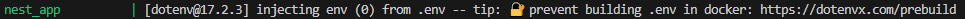

#  Handling Environment Variables & Configuration in NestJS
## Tasks
### Research how NestJS handles configuration using @nestjs/config
Official NestJS way to load and manage environment variables

### Set up an .env file to manage environment variables securely

### Explore how to validate environment variables in NestJS
Using fastify/env-schema, create a schema file that defines restrictions, load it into main

## Reflection
### How does @nestjs/config help manage environment variables?
It reads .env files automatically and injects values into the app, without manually loading .env everytime. It also supports schema validation.

### Why should secrets (e.g., API keys, database passwords) never be stored in source code?
If leaked, an attacker can gain access to secrets such as passwords or any other personal information. It also makes it harder to uphold secruity, as all hardcoded values must be changed one by one making it harder to rotate values.

### How can you validate environment variables before the app starts?
Using fastify/env-schema. Registered in main.ts, it will load the schema and .env to check if all the values are valid before starting the app.

### How can you separate configuration for different environments (e.g., local vs. production)?
You can use different .env files such as .env.local or .env.production, each with specific variables for the intended environment. In module.ts, specify which file you want to use.