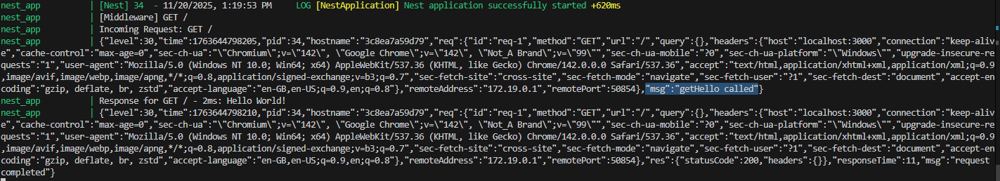
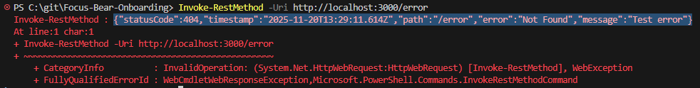

# Logging & Error Handling in NestJS
## Tasks
### Research how NestJS handles logging (nestjs-pino)
NestJS integration of Pino, a JSON logger. Configured in module and is injected into services/controllers that need to be logged.

### Set up structured logging using nestjs-pino

### Understand global exception handling in NestJS (@nestjs/common.HttpExceptionFilter)
Allows NestJS to catch and process errors consistently across the entire app. 

### Implement a custom exception filter to format API error responses

## Reflection
### What are the benefits of using nestjs-pino for logging?
Pino is optimised for logging, so larger logs won't nearly affect performance as much. They are also output as JSON, which makes it easy to parse and query to analyse any errors. It also supports middleware and interceptor logging. Additionally, it is highly customizable, allowing for customization of log levels, formats, transports (output destinations), serializers, and hooks for advanced use cases like masking sensitive data or integrating with external logging platforms.

### How does global exception handling improve API consistency?
With consistent error formatting, the API is predictable and standard. It also handles errors, centralizing and automating it, ensuring consistency across the app.

### What is the difference between a logging interceptor and an exception filter?
Logging interceptor will log all requests and responses, whereas an exception filter will only run when an error is thrown and it will format a JSON containing details of the error.

### How can logs be structured to provide useful debugging information?
- With JSON
    - Looks nicer than plain text, and can be queried
- Include context
    - What would have triggered this to log?
- Include timestamps
    - Its easier to figure out a timeline of events when given timestamps (how long something took to run, delay between functions, etc)
    - Runtimes are also useful
- Include related data
    - For example if we add a user, we should also log the details of the user we added
- Do not log sensitive data
    - Just for security
    - Pino allows for redacting fields