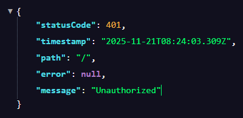

# Role-Based Authorization (RBAC) in NestJS
## Tasks
### Research how role-based access control (RBAC) works in Auth0
Restricts access based on user roles. Allows you to define roles, assign permissions, assign roles to users, enforce access control based on roles in the app. Uses Auth0 API based on the access token.

Example Workflow
1. Create permissions like read:messages, write:messages.
2. Create roles like admin with all permissions, user with read-only permissions.
3. Assign roles to users.
4. Enable RBAC in your Auth0 API settings.
5. Users authenticate, receive JWTs including permissions.
6. Your app validates JWT and checks if user has necessary permissions.

### Explore how to retrieve user roles from Auth0’s access token
By default, roles are not included in the access token. To include roles:
1. Go to your Auth0 Dashboard → APIs → Your API.
2. Under the Settings tab, enable the toggle for:
    - Enable RBAC
    - Add Permissions in the Access Token (this adds permissions; roles are separate)

To include roles themselves (not just permissions), you need to customize the token by adding roles explicitly.

Then, create a Rule or an Action to add roles as custom claims to the access token, because roles are not included by default. After decode and read roles from the access token in your backend.

### Implement a NestJS guard to enforce role-based authorization
src/auth/roles.decorator.ts shows the roles I have defined for my app.
```
export enum Role {
  ADMIN = 'admin',
  USER = 'user',
}

export const ROLES_KEY = 'roles';
export const Roles = (...roles: Role[]) => SetMetadata(ROLES_KEY, roles);
```

Then in src/auth/roles.decorator.ts I created the role guard to ensure that certain functions can only be done by the admin role
```
@Injectable()
export class RolesGuard implements CanActivate {
  constructor(private reflector: Reflector) {}

  canActivate(context: ExecutionContext): boolean {
    const requiredRoles = this.reflector.getAllAndOverride<Role[]>(ROLES_KEY, [
      context.getHandler(),
      context.getClass(),
    ]);
    if (!requiredRoles) {
      return true;
    }
    const { user } = context.switchToHttp().getRequest();
    return requiredRoles.some((role) => user.roles?.includes(role));
  }
}
```



To ensure it worked, I had to invoke web requests to /admin, where if I was admin, the guard would let me through.

## Reflection
### How does Auth0 store and manage user roles?
Auth0 stores and manages roles through its Management API and dashboard. The dashboard offers a GUI for users to manage roles, assignment etc.

### What is the purpose of a guard in NestJS?
A guard ensures that authorization is done and determines if a request can be fulfilled based on the users role/permissions. They also centralise authorisation logic, making it easier to apply authorisation.

### How would you restrict access to an API endpoint based on user roles?
1. Use a guard like JwtAuthGuard that validates the JWT, extracts user info, and attaches it to request.user.
2. Create roles decorator
3. Create guard
4. Apply roles decorator to routes

### What are the security risks of improper authorization, and how can they be mitigated?
Improper authorisation can lead to privilege escalation, where a user gains elevated permissions which they can use to cause attacks on the system. Sensitive data can be exposed, manipulated or deleted. They can be mitigated with proper authorisation techniques such as RBAC and using guards, giving users minimal permissions and using secure and validated tokens.