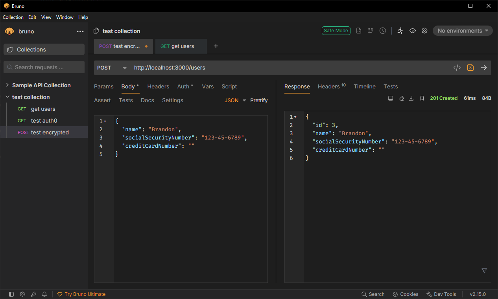
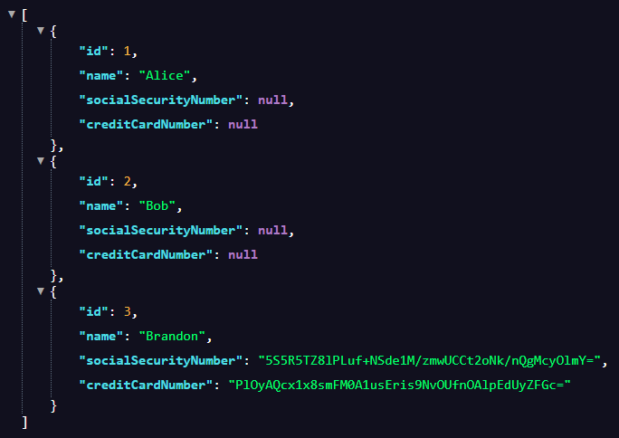

# Using typeorm-encrypted for Data Encryption
## Tasks
### Research how typeorm-encrypted works and why it’s needed
It is a library that integrates TypeORM to enable encryption of specific columns in database entities. A transformer class handles the logic of encryption and the subscribers will use the transformer when listening to entity events and apply encryption. Used to hide sensitive data easily.

### Implement typeorm-encrypted in a NestJS entity
An encryption transformer was created in encryption.config.ts
```
const config = new ConfigService();

export const encryptionTransformer = new EncryptionTransformer({
  key: config.get<string>('ENCRYPTION_KEY')!,
  algorithm: 'aes-256-cbc',
  ivLength: 16,
});
```

Additionally, the entity had to make make use of it where encryption was expected.
```
@Entity()
export class User {
  @PrimaryGeneratedColumn()
  id: number;

  @Column()
  name: string;

  @Column({
    type: 'varchar',
    nullable: true,
    transformer: encryptionTransformer,
  })
  socialSecurityNumber: string;

  @Column({
    type: 'varchar',
    nullable: true,
    transformer: encryptionTransformer,
  })
  creditCardNumber: string;
}
```

### Understand how encryption keys are managed and stored
To ensure my encryption worked, an encryption key was created and stored in .env. To use it I used config to retrive the value from .env

### Test encrypting and decrypting a database field
Using Bruno, I tested adding a user with an encrypted field.



To check that it was encrypted in the database, I created a method in service that would return all users straight from the database without parsing, so we can see what they look like stored.

```
  async getRawUsers() {
    // Query raw database without TypeORM transformers
    const raw = await this.userRepo.query(
      'SELECT * FROM users',
    );
    return raw;
  }
```

As can be seen in the screenshot, the user's SSN and credit card number are encrypted



## Reflection
### Why does Focus Bear double encrypt sensitive data instead of relying on database encryption alone?
- An extra layer of security is added
- Database keys and application keys are kept separate
    - Gaining access to database keys cannot decrypt the application layer data without access to application keys
- Protects from inside threats
    - Data is encrypted before even reaching the database, meaning developers can't even get access to it

### How does typeorm-encrypted integrate with TypeORM entities?
Using transformers, entities gain access to typeorm-encrypted.

### What are the best practices for securely managing encryption keys?
Never hard code and commit encryption keys, instead .env should be used and it should be put into .gitignore

### What are the trade-offs between encrypting at the database level vs. the application level?
Database encryption is simplier, as it is automatically done by the database system and is optimized for the database. However, anyone with access to the database can easily decrypt it, exposing sensitive data. Application level encryption is easier to control as what to encrypt can be decided, keys are managed separately from the database, data remains encrypted throughout movement. However, it is more complex and requires key management. It also has encryption/decryption overhead.