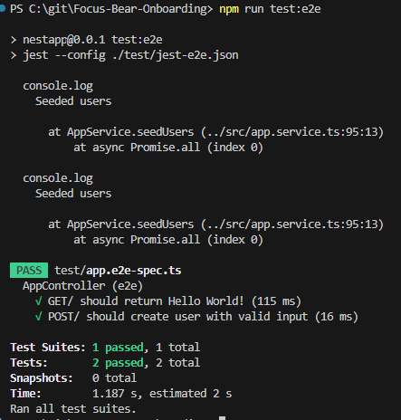

# Using Jest & Supertest for API Testing in NestJS
## Tasks
### Research how Supertest is used for API testing in NestJS
Used in E2E testing. Makes HTTP assertions to simulate HTTP requests. Recommended for NestJS since its a built in Node library. It is automatically included in NestJS CLI

### Write an integration test for a simple GET API endpoint and Write an integration test for a POST API endpoint with request validation
The GET and POST tests are found in test/app/e2e-spec.ts
```
  it('GET/ should return Hello World!', () => {
    return request(app.getHttpServer())
      .get('/')
      .expect(200)
      .expect('Hello World!');
  });

  it('POST/ should create user with valid input', async () => {
  jest.spyOn(appService, 'addUser').mockResolvedValue({
    id: 1,
    name: 'John Doe',
    socialSecurityNumber: '123456-1234567',
    creditCardNumber: '1234567890123456',
  });

  const response = await request(app.getHttpServer())
    .post('/users')
    .set('Authorization', `Bearer ${adminToken}`)
    .send({
      name: 'John Doe',
      socialSecurityNumber: '123456-1234567',
      creditCardNumber: '1234567890123456',
    })
    .expect(HttpStatus.CREATED);

  expect(response.body).toEqual({
    id: 1,
    name: 'John Doe',
    socialSecurityNumber: '123456-1234567',
    creditCardNumber: '1234567890123456',
  });
  expect(appService.addUser).toHaveBeenCalledWith(
    'John Doe',
    '123456-1234567',
    '1234567890123456',
  );
  }
```

Test JWT generator function in test-jwt.ts and must be generated after compling test module
```
  adminToken = generateTestJwt({
      sub: 1,          
      username: 'admin',
      roles: ['admin'] 
    });
```



## Reflection
### How does Supertest help test API endpoints?
Supertest simulates HTTP requests without a client. It is integrated directly into the app so it doesn't need to be running. It can also send request data, mocking real client requests.

### What is the difference between unit tests and API tests?
Unit tests test a small part of code, such as logic of a function. It is quick and easy and is done to verify code works as expected given inputs. API tests however, test larger parts of the system such as API routes, controllers, middleware, services and database. It ensures componenets interact correctly as if the environment was the same as what a user would use.

### Why should authentication be mocked in integration tests?
Authentication should be mocked because it isolates logic from the complexity of actual authentication, such as JWT signing, token expiration, OAuth flows. This simplifies the testing process and ensures any error are due to API rather than authentication. Authentication may also slow down testing if external calls are made.

### How can you structure API tests to cover both success and failure cases?
Tests can be grouped under the same `describe` block. Success cases send valid requests, assert expected status and expected body. Failure cases should send invalid or incomplete data and assert expected error. Tests should also be named appropriately.

Example with `describe` block:
```
describe('POST /users', () => {
  it('should create user with valid input', async () => { /* ... */ });

  it('should fail with 400 if name is missing', async () => { /* ... */ });

  it('should fail with 400 if SSN is invalid', async () => { /* ... */ });

  it('should fail with 401 if no auth token', async () => { /* ... */ });
});
```