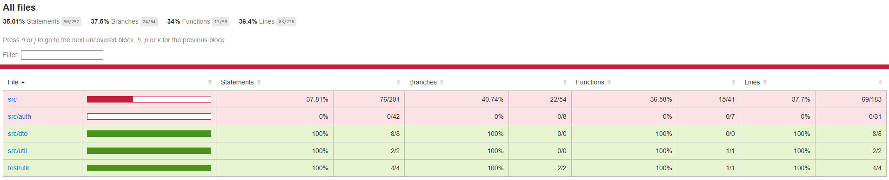
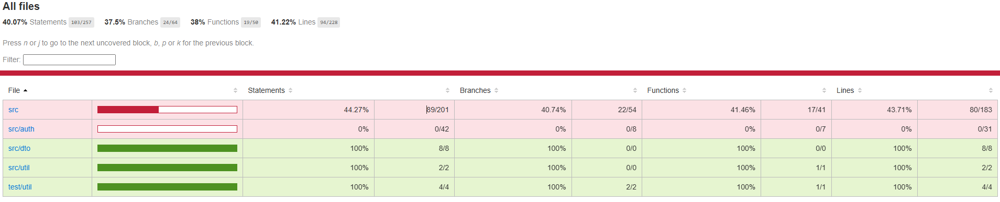

# Understanding the Focus Bear Coverage Bar & Writing Meaningful Tests
## Tasks
### Research how Jest generates test coverage reports in NestJS
Running Jest with `--converge` will record which lines/branches/functions run. Reports will also be automatically generated.
Because we are running a NestJS project, use `npm run test:cov` as its equivalent.

### Run the test suite and view the test coverage report
After running `npm run test:cov` in backend, terminal returned a short report of the total coverage. The more detailed report html is found locally in coverage/lcov-report/index.html. This is what it looks like:



### Identify untested areas and write additional tests to improve coverage
I created test for logging.interceptor.ts which went from completely untested to 100% coverage. This resulted in an increase in src coverage from 37.81% to 44.27%.



### Research the concept of "meaningful test assertions" and why high coverage can sometimes be misleading
Meaningful test assertions refer to checking that an output matches the expected outcome. With coverage, all it checks is that a piece of code has been tested not if it has been tested well. As such, high coverage can actually mislead developers into thinking the tests are well written when they actually don't handle enough edge cases, errors, etc.

### Refactor a weak test to ensure it has proper assertions
In counterSlice.spec.ts I changed the assertion such that the assertion value is dependent on the initial state to better reflect the logic of the test. This can also help identify bugs with the tests itself, such as the initialState being registered with the wrong value.
```
  it('should handle incrementByAmount', () => {
    const initialState = { value: 10 };

    const result = counterReducer(initialState, incrementByAmount(3));

    expect(result.value).toBe(initialState.value + 3); // no longer check for hard coded value
  });
```

## Reflection
### What does the coverage bar track, and why is it important?
The converge bar tracks % statements, branches, functions and lines that are tested by tests. It also reveals any uncovered lines. This is important as it gives a hollistic view as to what logic is/isn't tested.

### Why does Focus Bear enforce a minimum test coverage threshold?
A minimum test coverage threshold is generally useful for ensuring critical code is tested, keeps amount of tests consistent with size of code and supporting code reviews and collaboration.

### How can high test coverage still lead to untested functionality?
High test coverage is misleading as calling a function would count towards coverage but it doesn't actually mean anything unless assertions are made. Without proper assertions, the actual logic and behaviour of code is not properly tested. Additionally, in branches, coverage does not consider all possible branches and instead just checks if lines were ran. This can hide potential edge cases and errors.

### What are examples of weak vs. strong test assertions?
Weak
```
const result = add(2, 3);
expect(result).toBeDefined(); // does not test behaviour, only that there is an output (which can be wrong)
```
Strong
```
const result = add(2, 3);
expect(result).toBe(5); // tests what the expected outcome should be
```

### How can you balance increasing coverage with writing effective tests?
- Increment coverage gradually
    - Don't aim for 100% coverage
- Focus on tesing complex/critical code
- Write meaningful behaviour tests
- Coverage is just a guide, not the absolute goal
- Use the different testing strategies
- Make tests maintainable
    - Easy to update tests will be of higher quality and help with scalability