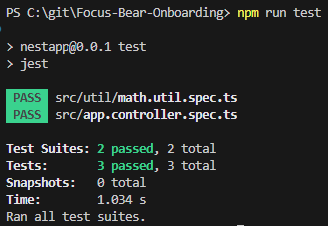
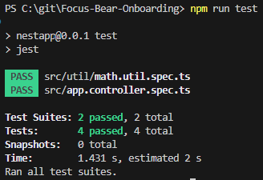

# Introduction to Unit Testing with Jest
## Tasks
### Research what Jest is and why unit tests are important.
Jest is a JavaScript testing framework. It can automatically find and run tests, provide functions to check results, mock functions and is included automatically in NestJS. Unit testing is important as it will define what is the expected outcome of the logic being tested. It will catch bugs early, make it easier to make appropriate changes, improve code quality and improve reliability of logic.

### Write a simple test for a utility function (e.g., a function that adds two numbers).
The test was created in src/util/math.util.spec.ts:
```
describe('add()', () => {
  it('should return the sum of two numbers', () => {
    expect(add(2, 3)).toBe(5);
  });

  it('should handle negative numbers', () => {
    expect(add(-4, 10)).toBe(6);
  });
});
```



### Why is automated testing important in software development?
Automated testing is important because it streamlines the testing process. Rather than manually testing, automated testing is simplier, more convenient and is able to automatically catch errors. This speeds up the development process, creating faster feedback and progression.

### What did you find challenging when writing your first Jest test?
As the work up until this point required a lot of dependencies and libraries to be installed, I had to mock all of those, ensuring that necessary values were mocked.

# Mocking API Calls in Jest
## Tasks
### Research how to mock API calls in Jest using jest.fn() and jest.mock().
`jest.fn()` to mock a function especially if dependencies are injected
`jest.mock()` to mock an entire module

### Write a Jest test that mocks the API call and verifies the component’s behavior.
In app.controller.spec.ts:
```
it('should mock an external API call', async () => {
    const mockResponse = {
      data: { id: 1, title: 'Test Todo' },
    }; // pretend this is the API response

    httpServiceMock.get.mockReturnValue(of(mockResponse));

    const result = await appService.getTodo(1);

    expect(result).toEqual({ id: 1, title: 'Test Todo' });
    expect(httpServiceMock.get).toHaveBeenCalledWith(
      'https://jsonplaceholder.typicode.com/todos/1'
    );
  });
```



### Why is it important to mock API calls in tests?
Since real API calls require network connection, mocking it will eliminate any network issues during testing, speeding up the testing process. It also makes it more reliable and isolates logical issues. Thus it will be easier to deduce if there are any issues with logic or API.

### What are some common pitfalls when testing asynchronous code?
Asynchronous code is hard to test because you must use `await` or `async` to ensure code doesn't run prematurely, thus returning an incorrect conclusion for the test. Race conditions may also be present if two functions are accessing the same data. Overall, asynchronous code has hard to predict behaviour due to code running at the same time and we must include keywords to tell it not to run prematurely.